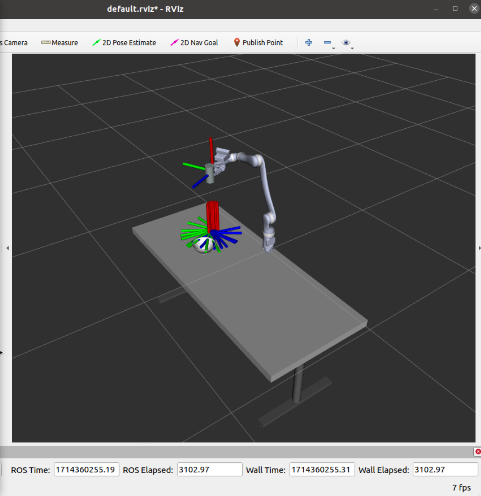

# Lab 4 Report

## Quick Start

1. Launch ROScore in a fresh terminal
    ```
    roscore
    ```

2. Launch RVIZ in another terminal
    ```
    rviz
    ```
    In `display type` add `RobotModel`, and in `topic` add `/soda_grasp/update/InteractiveMarkers`

3. Run the code
    ```
    cd code
    python soda_grasp_ik.py --sim # or --real
    ```

## Questions

### Part 7

The final pose of the can looks accurate.



### Part 8

This part includes the movements from the in-person lab, which not only involves picking up the can, but also moving it forward and tilting it.


https://github.com/csci545-spring-2024-classroom/lab4-terminator/assets/88414565/b307ae29-e603-4949-a4d7-6e56f5769ff1


## Resources Consulted

None

## Team Contributions

- Rohan: sections 1-3
- Matt: sections 4-6
- Harshitha: sections 7-8
- Scott: in-person lab
